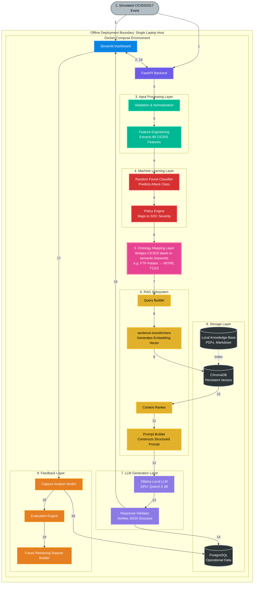

# ARIA — Autonomous SIEM Triage Assistant
## System Architecture Poster & Data Flow

This document provides the definitive visual architecture and operational flow for ARIA, designed specifically for an offline FYP environment running on an AMD Ryzen 7, 16GB RAM, and an RTX 3050 (6GB VRAM) laptop via Docker Compose.

---

### 1. High-Level Architecture Diagram

---

### 2. The 19-Step Execution Flow
*Follow the numbered paths in the diagram to trace the lifecycle of a security event.*

1. **Ingestion:** An analyst or automated replay script submits a simulated CICIDS2017 network flow event into the system.
2. **Gateway:** The Streamlit Dashboard forwards the payload via REST API to the FastAPI Backend.
3. **Validation:** FastAPI validates the schema and normalizes the payload into a canonical Alert object.
4. **Feature Engineering:** The payload is transformed into the exact 80-dimensional feature vector required by the ML model.
5. **Classification:** The Random Forest model predicts the raw attack class (e.g., `FTP-Patator`).
6. **Policy Mapping:** The Policy Engine maps the predicted class to a SOC severity level (e.g., `High`).
7. **Ontology Bridging (CRITICAL):** The raw synthetic ML output is passed into the Ontology Mapping Layer, which translates `FTP-Patator` into semantic cybersecurity keywords (e.g., `MITRE T1110`, `Brute Force Credential Attack`).
8. **Query Building:** The RAG Query Builder formulates a semantic search query using the expanded ontology keywords.
9. **Embedding:** The local `sentence-transformers` CPU model generates a vector representation of the query.
10. **Retrieval:** ChromaDB is queried using cosine similarity to retrieve the most relevant local documents.
11. **Ranking:** The Context Ranker selects and orders the top-K pieces of evidence.
12. **Prompt Construction:** The Prompt Builder merges the alert data, the ML prediction, and the retrieved context into a strict Jinja2 template.
13. **LLM Generation:** The prompt is sent to the local Ollama service (running on the RTX 3050 GPU), which generates an investigation briefing in JSON format.
14. **Validation:** The Response Validator checks that the LLM output is structurally sound and complete.
15. **Storage:** The final investigation report is persisted in PostgreSQL.
16. **Display:** The Streamlit Dashboard renders the investigation, evidence, and recommendations to the analyst.
17. **Feedback Submission:** The analyst reviews the report and submits a verdict (e.g., True Positive, False Positive) via the dashboard.
18. **Feedback Storage:** The verdict is logged in PostgreSQL, explicitly linked to the investigation without modifying the original ML prediction.
19. **Evaluation Loop:** The Evaluation Engine processes the feedback offline to generate a verified dataset for future manual model retraining.

---

### 3. Architecture Legend

* **Blue (`#0984e3`) - Presentation Layer:** The Streamlit user interface where analysts interact with ARIA.
* **Purple (`#6c5ce7`) - API Layer:** The FastAPI backend orchestrating the synchronous workflow.
* **Teal (`#00b894`) - Input Processing:** Validates and mathematically prepares data for the classifier.
* **Red (`#d63031`) - Machine Learning:** The classical ML components executing the fast CPU inference.
* **Pink (`#e84393`) - Ontology Mapping:** The vital conceptual bridge translating synthetic dataset strings into real-world threat intelligence.
* **Yellow (`#e1b12c`) - RAG Subsystem:** The CPU-bound retrieval pipeline sourcing evidence.
* **Lavender (`#8c7ae6`) - LLM Generation:** The GPU-bound text generation utilizing the local VRAM.
* **Dark Grey (`#2d3436`) - Storage Layer:** The persistent, offline databases retaining state and knowledge.
* **Orange (`#e67e22`) - Feedback Layer:** The human-in-the-loop closure, measuring success and building future datasets.

---

### 4. Key Architectural Insights

#### 1. Why the Ontology Mapping Layer is Essential
CICIDS2017 attack classes (like `DoS Hulk`) are academic/synthetic labels. Sending "DoS Hulk" directly into a semantic vector search against enterprise documentation (like MITRE ATT&CK or CVEs) will yield poor or zero matches. The **Ontology Mapping Layer** intercepts the ML output and expands it into real-world, retrieval-friendly keywords (e.g., `MITRE T1498`, `Volumetric Denial of Service`) *before* generating the search query. This guarantees the RAG pipeline finds highly relevant evidence.

#### 2. The Strict Offline Boundary
There are zero external dependencies in this architecture. Once the local knowledge base is populated, the entire stack—spanning the UI, API, Databases, Classifier, Embedding Models, and the LLM—runs completely on the target laptop. The Docker Compose configuration manages all internal networking securely.

#### 3. GPU vs CPU Isolation
The architecture intentionally isolates the heavy text-generation workload. While validation, normalization, classical ML (Random Forest), and vector embeddings (`sentence-transformers`) all run rapidly on the Ryzen 7 CPU, the Ollama LLM (`Qwen2.5 3B`) is pinned to the RTX 3050 GPU, maximizing the use of the limited 6GB VRAM specifically for inference without causing system-wide memory starvation.
