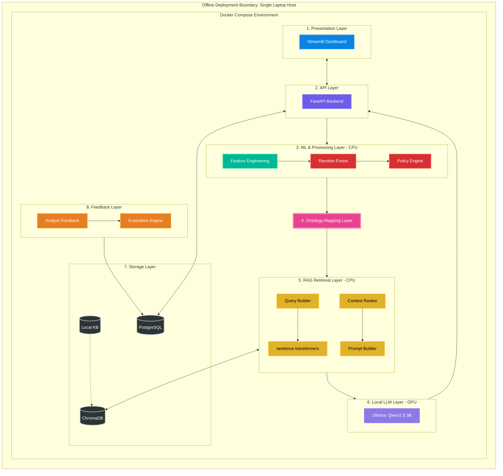

# ARIA — Autonomous SIEM Triage Assistant
## Architecture Posters & Visual Flow

This document provides two distinct visualizations of the ARIA system, designed specifically for your FYP report and viva presentation.

---

### Poster 1: High-Level System Architecture
*Designed to show the physical layout, deployment boundaries, and subsystem boundaries at a glance. Perfect for explaining "what" the system is and "where" things run.*

---

### Poster 2: Runtime Execution Flow
*Designed for the examiner. A strict, chronological flowchart showing exactly how data moves through the system from ingest to output in under 2 minutes.*

```mermaid
flowchart TD
    %% Styling
    classDef startend fill:#2d3436,stroke:#b2bec3,stroke-width:2px,color:#fff;
    classDef ui fill:#0984e3,stroke:#74b9ff,stroke-width:2px,color:#fff;
    classDef api fill:#6c5ce7,stroke:#a29bfe,stroke-width:2px,color:#fff;
    classDef processing fill:#00b894,stroke:#55efc4,stroke-width:2px,color:#fff;
    classDef ml fill:#d63031,stroke:#ff7675,stroke-width:2px,color:#fff;
    classDef ontology fill:#e84393,stroke:#fd79a8,stroke-width:3px,color:#fff;
    classDef rag fill:#e1b12c,stroke:#fbc531,stroke-width:2px,color:#000;
    classDef llm fill:#8c7ae6,stroke:#9c88ff,stroke-width:2px,color:#fff;
    classDef storage fill:#2d3436,stroke:#b2bec3,stroke-width:2px,color:#fff;

    USER([1. Analyst / Simulated Alert]):::startend --> DASH[2. Streamlit Dashboard]:::ui
    DASH --> API[3. FastAPI Backend]:::api
    API --> VAL[4. Alert Validation]:::processing
    VAL --> FEAT[5. Feature Engineering<br/>80 CICIDS Features]:::processing
    FEAT --> RF[6. Random Forest Classifier]:::ml
    RF --> POL[7. Policy Engine<br/>SOC Severity]:::ml
    POL --> ONTO[8. Ontology Mapping Layer<br/>e.g. FTP-Patator -> MITRE T1110]:::ontology
    ONTO --> QB[9. RAG Query Builder]:::rag
    QB --> EMB[10. Embedding Model<br/>sentence-transformers]:::rag
    EMB --> CHR[(11. ChromaDB Vector Search)]:::storage
    CHR --> RANK[12. Context Ranker<br/>Top-K Evidence]:::rag
    RANK --> PB[13. Prompt Builder]:::rag
    PB --> OLLAMA[14. Ollama LLM<br/>Investigation Brief Generation]:::llm
    OLLAMA --> VLD[15. Response Validator<br/>JSON Structure Check]:::processing
    VLD --> PG[(16. PostgreSQL Database)]:::storage
    PG --> DASH_OUT[17. Dashboard Display]:::ui
    DASH_OUT --> FB([18. Analyst Feedback]):::startend
```

---

### Architectural Legend

* **Blue (`#0984e3`) - Presentation:** The Streamlit user interface where analysts interact with ARIA.
* **Purple (`#6c5ce7`) - API:** The FastAPI backend orchestrating the workflow.
* **Teal (`#00b894`) - Processing & Validation:** Data cleaning, normalization, and mathematical extraction.
* **Red (`#d63031`) - Machine Learning:** The classical ML components executing the fast CPU inference.
* **Pink (`#e84393`) - Ontology Mapping:** The conceptual bridge translating synthetic dataset strings into real-world threat intelligence keywords.
* **Yellow (`#e1b12c`) - RAG Subsystem:** The CPU-bound retrieval pipeline sourcing evidence.
* **Lavender (`#8c7ae6`) - LLM Generation:** The GPU-bound text generation utilizing local VRAM.
* **Dark Grey (`#2d3436`) - Storage & External:** The persistent databases retaining state, and the external user boundaries.
* **Orange (`#e67e22`) - Feedback:** The human-in-the-loop closure for future retraining.
